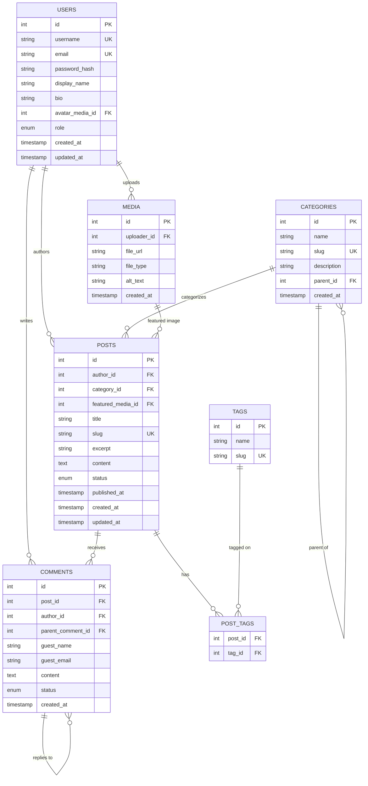

# Database Design: Blog / CMS

Relational (SQL) schema for a blog / content-management system. Covers
authoring, categorization, tagging, threaded comments, and media uploads.

## Entities

| Entity | Purpose |
|---|---|
| `users` | Authors, editors, admins, and registered commenters |
| `categories` | Hierarchical grouping for posts (supports subcategories) |
| `tags` | Free-form labels attached to posts (many-to-many) |
| `posts` | Blog articles/pages |
| `post_tags` | Junction table resolving the posts↔tags many-to-many relationship |
| `comments` | Threaded comments on posts, from registered users or guests |
| `media` | Uploaded files (images, etc.) referenced by posts and users |

## ER Diagram

## Table Definitions

### `users`
| Column | Type | Constraints |
|---|---|---|
| id | INTEGER | PK, auto-increment |
| username | VARCHAR(50) | UNIQUE, NOT NULL |
| email | VARCHAR(255) | UNIQUE, NOT NULL |
| password_hash | VARCHAR(255) | NOT NULL |
| display_name | VARCHAR(100) | NOT NULL |
| bio | TEXT | NULL |
| avatar_media_id | INTEGER | FK → media.id, NULL |
| role | ENUM('admin','editor','author','subscriber') | NOT NULL, DEFAULT 'subscriber' |
| created_at | TIMESTAMP | NOT NULL, DEFAULT now() |
| updated_at | TIMESTAMP | NOT NULL, DEFAULT now() |

### `categories`
| Column | Type | Constraints |
|---|---|---|
| id | INTEGER | PK, auto-increment |
| name | VARCHAR(100) | NOT NULL |
| slug | VARCHAR(120) | UNIQUE, NOT NULL |
| description | TEXT | NULL |
| parent_id | INTEGER | FK → categories.id, NULL (self-reference for subcategories) |
| created_at | TIMESTAMP | NOT NULL, DEFAULT now() |

### `tags`
| Column | Type | Constraints |
|---|---|---|
| id | INTEGER | PK, auto-increment |
| name | VARCHAR(50) | NOT NULL |
| slug | VARCHAR(60) | UNIQUE, NOT NULL |

### `posts`
| Column | Type | Constraints |
|---|---|---|
| id | INTEGER | PK, auto-increment |
| author_id | INTEGER | FK → users.id, NOT NULL |
| category_id | INTEGER | FK → categories.id, NULL |
| featured_media_id | INTEGER | FK → media.id, NULL |
| title | VARCHAR(255) | NOT NULL |
| slug | VARCHAR(280) | UNIQUE, NOT NULL |
| excerpt | VARCHAR(500) | NULL |
| content | TEXT | NOT NULL |
| status | ENUM('draft','published','archived') | NOT NULL, DEFAULT 'draft' |
| published_at | TIMESTAMP | NULL |
| created_at | TIMESTAMP | NOT NULL, DEFAULT now() |
| updated_at | TIMESTAMP | NOT NULL, DEFAULT now() |

Index: `(status, published_at)` to speed up "published posts by date" queries.

### `post_tags`
| Column | Type | Constraints |
|---|---|---|
| post_id | INTEGER | PK (composite), FK → posts.id |
| tag_id | INTEGER | PK (composite), FK → tags.id |

### `comments`
| Column | Type | Constraints |
|---|---|---|
| id | INTEGER | PK, auto-increment |
| post_id | INTEGER | FK → posts.id, NOT NULL |
| author_id | INTEGER | FK → users.id, NULL (NULL = guest comment) |
| parent_comment_id | INTEGER | FK → comments.id, NULL (self-reference for threaded replies) |
| guest_name | VARCHAR(100) | NULL (required when author_id is NULL) |
| guest_email | VARCHAR(255) | NULL (required when author_id is NULL) |
| content | TEXT | NOT NULL |
| status | ENUM('pending','approved','spam') | NOT NULL, DEFAULT 'pending' |
| created_at | TIMESTAMP | NOT NULL, DEFAULT now() |

### `media`
| Column | Type | Constraints |
|---|---|---|
| id | INTEGER | PK, auto-increment |
| uploader_id | INTEGER | FK → users.id, NOT NULL |
| file_url | VARCHAR(500) | NOT NULL |
| file_type | VARCHAR(50) | NOT NULL |
| alt_text | VARCHAR(255) | NULL |
| created_at | TIMESTAMP | NOT NULL, DEFAULT now() |

## Design Notes

- **Normalization**: schema is in 3NF — tags and categories are extracted
  into their own tables rather than stored as strings on `posts`, avoiding
  update anomalies and duplicated text.
- **Many-to-many via junction table**: `post_tags` resolves posts↔tags
  without denormalizing either side.
- **Self-referencing FKs**: `categories.parent_id` supports nested
  categories (e.g. "Tech" → "Databases"); `comments.parent_comment_id`
  supports threaded replies.
- **Guest comments**: `comments.author_id` is nullable so unauthenticated
  visitors can comment via `guest_name`/`guest_email`, while registered
  users are linked by FK.
- **Slugs over IDs in URLs**: `slug` columns are unique and indexed to
  support human-readable, SEO-friendly URLs (`/posts/my-first-post`).
- **Soft state via `status` enums** rather than deleting rows, so drafts,
  archived posts, and moderated comments remain recoverable.
